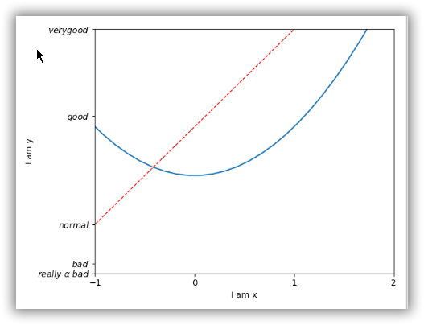

# Matplotlib 画图

## 一、安装

先安装`numpy`

```shell
pip install numpy -i http://pypi.douban.com/simple/ --trusted-host pypi.douban.com

```

再安装`matplotlib`

```shell
pip install matplotlib -i http://pypi.douban.com/simple/ --trusted-host pypi.douban.com

```

## 二、基本用法

### 基本样例

```python
import matplotlib.pyplot as plt
import numpy as np

x = np.linspace(-1, 1, 51) #在[-1, 1]上取51个点
y = 2 * x + 1
plt.plot(x, y)
plt.show()
```

`np.linspace(start, end, p)`，`p`：均分多少份

表示从`start`到`end`，均分`p`份

### 正常显示中文

```python
plt.rcParams['font.sans-serif'] = ['SimHei']  # 用来正常显示中文标签
plt.rcParams['axes.unicode_minus'] = False  # 用来正常显示负号
```

### `figure`窗口

`figure()`

以`figure()`开头后面都是设置这个`figure`的

参数：
	num: figure编号
	fgsize = (a, b), a:长，b:宽

`plot()`

可以设置线条颜色、线宽、线条的样式。如：`color = '', linewidth = x, linestyle='--'`

```python
import matplotlib.pyplot as plt
import numpy as np

x = np.linspace(-1, 1, 51)
y1 = 2 * x + 1
y2 = x ** 3

plt.figure()
plt.plot(x, y1)

plt.figure(num=3, figsize=(8,5))
plt.plot(x, y2)
plt.plot(x, y1, color = 'red', linewidth = 10, linestyle = '--')


plt.show()
```

### `axis`

#### 限制坐标轴范围:

​	限制x：`xlim((start, end))`
​	限制y：`ylim((start, end))`

#### 添加坐标轴描述:

​	描述x轴：`xlabel('这里是x轴的描述')`
​	描述y轴：`ylabel('这里是y轴的描述')`

#### 设置坐标轴的点（ticks）

​	设置x轴ticks：`xticks(new_ticks)`
​	设置y轴tick：`yticks(new_ticks)`

`tick`可以单纯设置为数字数列，也可以设置为“文字数列”，但是其实也是要对应数字数列的，如：`yticks(num_ticks, word_ticks)`

```python
new_ticks = np.linspace(-1,2,4)
print(new_ticks)
plt.xticks(new_ticks)
plt.yticks([-2, -1.8, -1, 1.22, 3],
           ['really bad', 'bad', 'normal', 'good', 'very good'])
```

对应的`str`可以写成形如`r'$内容$'`的形式，在里面就可以通过`\`符号，转义一些东西，如`\alpha`

```python
import matplotlib.pyplot as plt
import numpy as np

x = np.linspace(-3, 3, 50)
y1 = 2 * x + 1
y2 = x ** 2

plt.figure()
plt.plot(x, y2)
plt.plot(x, y1, color='red', linewidth = 1.0, linestyle = '--')

plt.xlim((-1,2))
plt.ylim((-2,3))
plt.xlabel('I am x')
plt.ylabel('I am y')

new_ticks = np.linspace(-1,2,4)
print(new_ticks)
plt.xticks(new_ticks)
plt.yticks([-2, -1.8, -1, 1.22, 3],
           [r'$really\ \alpha\ bad$', r'$bad$', r'$normal$', r'$good$', r'$very good$'])


plt.show()

```



#### `axis.spines`

即四个坐标轴， `left`, `right`, `top`, `bottom`

##### 获取当前坐标轴

`ax = plt.gca()`, `# gca = 'get current axis'`

获取到之后就可以对它进行设置了

##### 设置某一轴消失

`ax.spines['<direction>'].set_color('none')`
	`<direction>`:  `left`, `right`, `top`, `bottom`

##### 设置x轴、y轴

设置`x`轴：`ax.xaxis.set_ticks_position('<direction>')`
设置`y`轴：`ax.yaxis.set_ticks_position('<direction>')`

##### 设置坐标原点

`ax.spines['<direction>'].set_position(('data', x))`

表示以数据x为`<direction>`这个轴的原点

### Legend

图例

#### 显示图例

方式一：

1.在`plot中指定线条的label参数`，如`l1, = plt.plot(x, y2, label = 'up')`
2.使用`plt.legend()`, 则默认会以你指定的描述来显示图例

PS：
	1.多条线时，图例中只会显示设置了`label`参数的线。如果一个都没有设置，图例不显示，会有错误提示。
	2.此时，图例位置是`best`的，即它会自己根据图形调整位置，尽量不遮挡图线。

方式二：

在`plt.legend()`中用参数指定，具有如下参数：
	`handles = []`：传入一个线条列表，线条对象的获取使用`l1, = plt.plot()`， 注意一定要有那个`,`(emm， 不知道为什么)
	`labels = []`：传入一个描述列表，和`handles`一一对应即可。不传入时，则依据`plot()`中指定的描述；传入时，依据该描述。
	`loc = '<location>'`， 默认是`best`(自动调整位置)， 还可以有其他值，如：	

`best`,  `right`
`upper left`, `upper right`  ,`upper center`
`lower left` ,`lower right` ,`lower center`
 `center left `, `center right` ,  `center`

```python
import matplotlib.pyplot as plt
import numpy as np

x = np.linspace(-3, 3, 50)
y1 = 2 * x + 1
y2 = x ** 2

plt.figure()


plt.xlim((-1,2))
plt.ylim((-2,3))
plt.xlabel('I am x')
plt.ylabel('I am y')

new_ticks = np.linspace(-1,2,4)
plt.xticks(new_ticks)
plt.yticks([-2, -1.8, -1, 1.22, 3],
           [r'$really\ \alpha\ bad$', r'$bad$', r'$normal$', r'$good$', r'$very good$'])

l1, = plt.plot(x, y2, label = 'up')
l2, = plt.plot(x, y1, color='red', linewidth = 1.0, linestyle = '--', label = 'down')

ax = plt.gca()
ax.spines['right'].set_color('none')
ax.spines['top'].set_color('none')


# 图例
plt.legend(handles=[l1, l2], loc='lower left')
# plt.legend()


plt.show()

```

### `Annonotation`

标注

标注一：

```python
plt.text(x, y, '<context>',
         fontdict={'size': 16, 'color': 'r'})
```

x：显示标注的`x`坐标
y：显示标注的`y`坐标
`<context>`：标注内容
`fontdict`：字体属性设置， `r`是红色的简写， `k`是黑色的简写


标注二：

```python
plt.annotate('<context>', xy=(x, y), xycoords='data',
             xytext=(ox, oy), textcoords='offset points', fontsize=16,
             arrowprops=dict(arrowstyle='->', connectionstyle='arc3, rad=.2'))
```

`xy`：箭头尖端坐标
`xycoords`， `textcoords`：以什么为坐标单位，可选有以下值：

​	`data`：使用轴域数据坐标系
​	`offset points`：使用偏移量计算坐标

`fontsize`：标注字体大小
`arrowprops`：一个箭头属性字典

更多详细信息参考：[matplotlib注释](https://www.cnblogs.com/black-mamba/p/9473548.html)